# Backend Class Diagram - Yam Application

```mermaid
classDiagram
    %% Application Entry Point
    class JeeExamenApplication {
        +main(String[] args)
    }

    %% Controllers
    class AuthController {
        +register(AuthRegisterRequest)
        +login(AuthLoginRequest)
    }
    
    class GameController {
        +getGame(Long)
        +roll(Long)
        +lockAndRoll(Long, LockRequest)
        +score(Long, ScoreRequest)
        +abandon(Long)
    }
    
    class LobbyController {
        +ready()
        +cancelReady()
    }
    
    class HallOfFameController {
        +top(int)
    }

    %% Services
    class AuthService {
        +register(AuthRegisterRequest)
        +login(AuthLoginRequest)
    }
    
    class GameService {
        +createGame(Long, Long)
        +getGame(Long, Long)
        +roll(Long, Long)
        +lockAndRoll(Long, Long, List~Integer~)
        +score(Long, Long, Category)
        +abandon(Long, Long)
        +applyTimeoutPenaltyIfNeeded(Long, GameState)
    }
    
    class LobbyService {
        +ready(Long)
        +cancelReady(Long)
    }
    
    class HallOfFameService {
        +top(int)
    }
    
    class ScoreService {
        +possibleScores(int[], ColonneScore)
        +score(Category, int[])
        +isFilled(ColonneScore, Category)
        +recomputeTotals(ColonneScore, int)
        +allCategoriesFilled(ColonneScore)
    }
    
    class DiceService {
        +rollAll()
        +rerollUnlocked(int[], boolean[])
    }
    
    class JwtService {
        +generateToken(String)
        +extractUsername(String)
        +isTokenValid(String, UserDetails)
    }
    
    class AuthenticatedUserService {
        +currentUser()
    }
    
    class GameStateManager {
        +get(Long)
        +put(Long, GameState)
        +remove(Long)
    }

    %% Entities
    class Joueur {
        -Long id
        -String pseudo
        -String mdp
        +getId()
        +getPseudo()
        +getMdp()
    }
    
    class Parties {
        -Long id
        -PartieStatus status
        -Long idVainqueur
        +getId()
        +getStatus()
        +getIdVainqueur()
    }
    
    class ColonneScore {
        -Long idPartie
        -Long idJoueur
        -Integer score1..6
        -Integer scoreBrelan..Chance
        -Integer totalNumbers
        -Integer totalNumbersBonus
        -Integer scoreTotal
    }

    %% Runtime Classes
    class GameState {
        -Long partieId
        -List~Long~ playerIds
        -Long currentPlayerId
        -int[] dice
        -boolean[] locked
        -int rollCount
        -long turnStartedAt
        -long turnDeadlineAt
        -Map~Long, Integer~ extraYamCount
        -RuntimeGameStatus status
    }
    
    class LobbyEntry {
        -Long playerId
        -long readyAt
        -long expiresAt
    }

    %% Repositories
    class JoueurRepository {
        +findByPseudo(String)
        +existsByPseudo(String)
        +save(Joueur)
    }
    
    class PartiesRepository {
        +findById(Long)
        +save(Parties)
    }
    
    class ColonneScoreRepository {
        +findByIdPartieAndIdJoueur(Long, Long)
        +findByIdPartieOrderByIdJoueurAsc(Long)
        +existsByIdPartieAndIdJoueur(Long, Long)
        +findTopByPartieStatus(List~PartieStatus~, Pageable)
        +save(ColonneScore)
    }

    %% DTOs (simplified representation)
    class AuthRegisterRequest {
        -String pseudo
        -String password
    }
    
    class AuthLoginRequest {
        -String pseudo
        -String password
    }
    
    class LockRequest {
        -List~Integer~ lockedIndexes
    }
    
    class ScoreRequest {
        -Category category
    }

    %% Enums
    class PartieStatus {
        <<enumeration>>
        EN_COURS
        TERMINE
        ABANDON
    }
    
    class RuntimeGameStatus {
        <<enumeration>>
        IN_PROGRESS
        FINISHED
    }
    
    class Category {
        <<enumeration>>
        ONE, TWO, THREE, FOUR, FIVE, SIX
        BRELAN, CARRE, FULL
        PETITE_SUITE, GRANDE_SUITE
        YAM, CHANCE
    }

    %% Relationships
    
    %% Application to Controllers
    JeeExamenApplication --> AuthController
    JeeExamenApplication --> GameController
    JeeExamenApplication --> LobbyController
    JeeExamenApplication --> HallOfFameController

    %% Controllers to Services
    AuthController --> AuthService
    AuthController --> AuthenticatedUserService
    
    GameController --> GameService
    GameController --> AuthenticatedUserService
    
    LobbyController --> LobbyService
    LobbyController --> AuthenticatedUserService
    
    HallOfFameController --> HallOfFameService

    %% Services to Repositories
    AuthService --> JoueurRepository
    AuthService --> JwtService
    
    GameService --> PartiesRepository
    GameService --> ColonneScoreRepository
    GameService --> JoueurRepository
    GameService --> GameStateManager
    GameService --> DiceService
    GameService --> ScoreService
    GameService --> LobbyService
    
    LobbyService --> GameService
    
    HallOfFameService --> ColonneScoreRepository
    
    ScoreService --> ColonneScore
    
    %% Services to Runtime Classes
    GameService --> GameState
    LobbyService --> LobbyEntry
    GameStateManager --> GameState
    
    %% Services to other Services
    AuthService --> JwtService
    GameService --> LobbyService
    GameService --> ScoreService
    GameService --> DiceService
    GameService --> AuthenticatedUserService
    LobbyService --> GameService
    HallOfFameService --> ColonneScoreRepository

    %% Cross-dependencies
    AuthenticatedUserService --> JoueurRepository
    GameService --> AuthenticatedUserService

    %% DTO relationships
    AuthController --> AuthRegisterRequest
    AuthController --> AuthLoginRequest
    GameController --> LockRequest
    GameController --> ScoreRequest

    %% Entity relationships (simplified)
    Parties --> ColonneScore
    Joueur --> ColonneScore
    GameState --> ColonneScore

    %% Note: Styling removed to prevent parsing issues
    %% Controllers are in Presentation Layer
    %% Services are in Business Logic Layer  
    %% Repositories are in Data Access Layer
    %% Entities are in Data Layer
    %% Runtime classes manage in-memory state
```

## Architecture Summary

### **Layered Architecture**

1. **Presentation Layer (Controllers)**
   - Handle HTTP requests and responses
   - Delegate business logic to services
   - Use DTOs for data transfer

2. **Business Logic Layer (Services)**
   - Core application logic and orchestration
   - Cross-service dependencies for complex operations
   - Use repositories for data access
   - Manage runtime state through GameStateManager

3. **Data Access Layer (Repositories)**
   - JPA repositories for database operations
   - Custom queries for complex data retrieval
   - Entity relationships managed by JPA

4. **Runtime Layer**
   - In-memory state management for active games
   - Real-time game state tracking
   - Lobby queue management

### **Key Design Patterns**

- **Dependency Injection**: All services and repositories are injected
- **Repository Pattern**: Clean data access abstraction
- **Service Layer**: Business logic encapsulation
- **State Management**: Runtime state separate from persistent entities
- **DTO Pattern**: Clean API contracts

### **Critical Relationships**

- **Game Flow**: LobbyController → LobbyService → GameService → GameState
- **Authentication**: AuthController → AuthService → JwtService
- **Scoring**: GameController → GameService → ScoreService → ColonneScore
- **State Management**: GameService ↔ GameStateManager ↔ GameState

This architecture provides clear separation of concerns while maintaining the flexibility needed for real-time game operations.