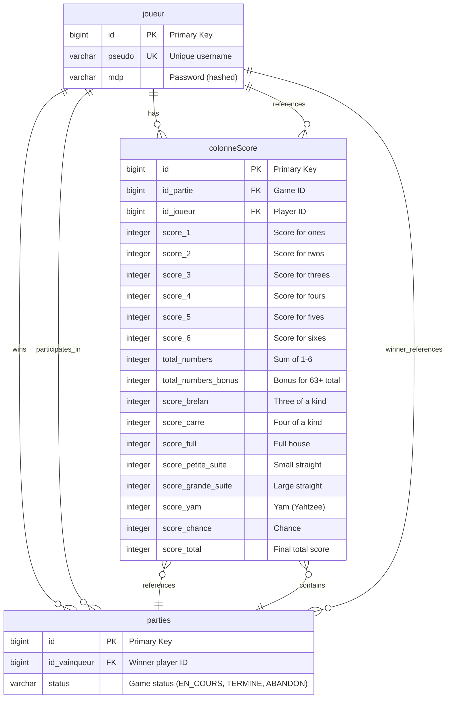

# Database Schema Diagram - Yam Application

## Database Schema Summary

### **Tables Overview**

#### **1. joueur (Players)**
- **Purpose**: Stores user/player information
- **Key Fields**:
  - `id`: Auto-incremented primary key
  - `pseudo`: Unique username (NOT NULL, UNIQUE)
  - `mdp`: Password hash (NOT NULL)
- **Constraints**: Unique pseudo prevents duplicate usernames

#### **2. parties (Game Sessions)**
- **Purpose**: Tracks individual game sessions
- **Key Fields**:
  - `id`: Auto-incremented primary key
  - `id_vainqueur`: Foreign key to winning player (nullable)
  - `status`: Game status enum (EN_COURS, TERMINE, ABANDON)
- **Constraints**: Status ensures proper game lifecycle

#### **3. colonneScore (Player Score Sheets)**
- **Purpose**: Stores individual player scores for each game
- **Key Fields**:
  - `id`: Auto-incremented primary key
  - `id_partie`: Foreign key to game session
  - `id_joueur`: Foreign key to player
  - Individual scores for each category (1-6, brelan, carre, etc.)
  - Calculated totals and bonuses
- **Constraints**: Composite uniqueness on (id_partie, id_joueur)

### **Relationships**

#### **One-to-Many Relationships:**
1. **Joueur → Parties**: One player can participate in many games
2. **Joueur → ColonneScore**: One player can have many score sheets
3. **Parties → ColonneScore**: One game contains multiple score sheets (2 players)

#### **Many-to-One Relationships:**
1. **ColonneScore → Joueur**: Score sheet belongs to one player
2. **ColonneScore → Parties**: Score sheet belongs to one game
3. **Parties → Joueur**: Game has one winner (nullable for unfinished games)

### **Data Integrity**

#### **Foreign Key Constraints:**
- `colonneScore.id_joueur` references `joueur.id`
- `colonneScore.id_partie` references `parties.id`
- `parties.id_vainqueur` references `joueur.id`

#### **Business Rules:**
- Each game must have exactly 2 players (enforced by application logic)
- Each player can have only one score sheet per game
- Game status tracks lifecycle: EN_COURS → (TERMINE | ABANDON)
- Winner is only set when game is completed

### **Scoring System**

#### **Upper Section (1-6):**
- Scores for each dice value
- Sum determines `total_numbers`
- Bonus of 35 if `total_numbers` ≥ 63

#### **Lower Section:**
- **Brelan**: Three of a kind
- **Carre**: Four of a kind  
- **Full**: Full house (3+2)
- **Petite Suite**: Small straight (4 consecutive)
- **Grande Suite**: Large straight (5 consecutive)
- **Yam**: Five of a kind (Yahtzee)
- **Chance**: Sum of all dice

#### **Total Calculation:**
- `score_total` = Sum of all category scores + bonus + extra Yam bonuses

This schema efficiently supports the Yahtzee game mechanics while maintaining referential integrity and enabling leaderboard functionality through the Hall of Fame queries.